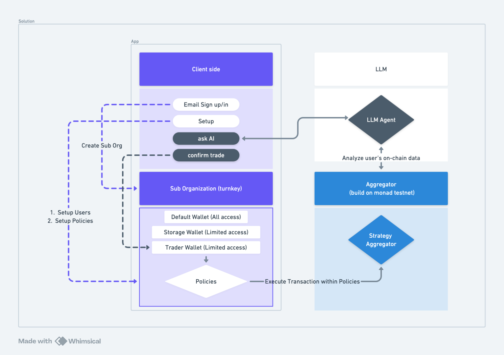
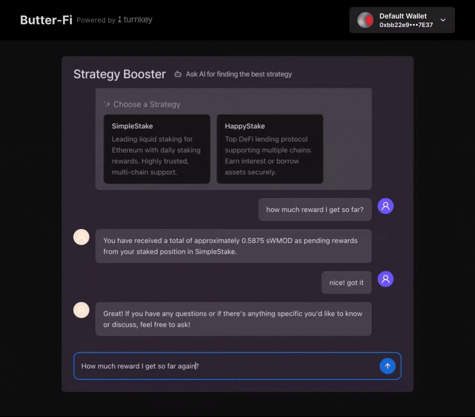

# Butter-Fi: AI-Powered Secure Trading on Monad with Turnkey

Butter-Fi is an AI-powered, secure trading platform built on the Monad blockchain, providing users with a seamless and secure wallet experience through Turnkey's wallet infrastructure. Our platform enhances trading security, efficiency, and automation, allowing users to execute transactions with confidence.

- App demo: https://butter-fi-app.vercel.app/
- App repo: https://github.com/jill6666/butter-fi-app
- Contract repo: https://github.com/WangWang0226/Butter-Fi-Foundry
- LLM repo: https://github.com/WangWang0226/Butter-Fi-LLM

## Features

#### 🔐 Multi-Sig Wallets
Butter-Fi utilizes Sub-Organizations as end-user-controlled wallets

We set up two user roles within a Sub-Organization, each with distinct permissions:

1. Admin: The root user with full access and control over all transactions.

2. Trader: A restricted API-key-only user, who can only execute transactions within predefined policies.

#### ⚖️ Custom Transaction Policies
Butter-Fi provides predefined trading strategies, ensuring that every transaction aligns with security best practices. All transactions executed by strategies or users must adhere to clearly defined policies, mitigating risks while maintaining efficiency.

#### 🛠 Embedded Wallets
Our platform offers seamless wallet integration, ensuring a frictionless user experience. Users retain 100% control over their private keys, which can be exported at any time, ensuring full self-custody.

## Getting Started
To start using Butter-Fi, follow these steps:

1. **Sign Up**: Create an account with email on the [Butter-Fi platform]('https://butter-fi-app.vercel.app/')

2. **Setup**: Configure traders and define transaction policies. 

> Navigate to `/account` and click "Setup Trader and Policies" next to the Users card. (This process may take some time—open the console to check progress or refresh the page.)

3. **Explore DeFi Services**: Interact with the AI chatbot to execute trades effortlessly

> Navigate to `/dashboard` and start chatting with Butter!

- Get investment recommendations.
- Execute transactions on Monad.
- Check account balances and trading statements.
- Modify or exit trading strategies at any time.

## Documentation
For detailed integration and API usage, refer to the official Turnkey SDK/API documentation: [Turnkey API Reference]('https://docs.turnkey.com')

## Contribution
We welcome contributions from the community! If you're interested in improving Butter-Fi, please contact us for details on how to get involved.

## License
Butter-Fi is licensed under the MIT License

## Acknowledgements
We extend our gratitude to the Monad and Turnkey teams for their support and for providing the infrastructure that powers Butter-Fi.

📌 Note: This project was developed as part of the "Best use of Turnkey for Monad" bounty, aiming to showcase the seamless integration of Turnkey's wallet infrastructure within the Monad ecosystem.